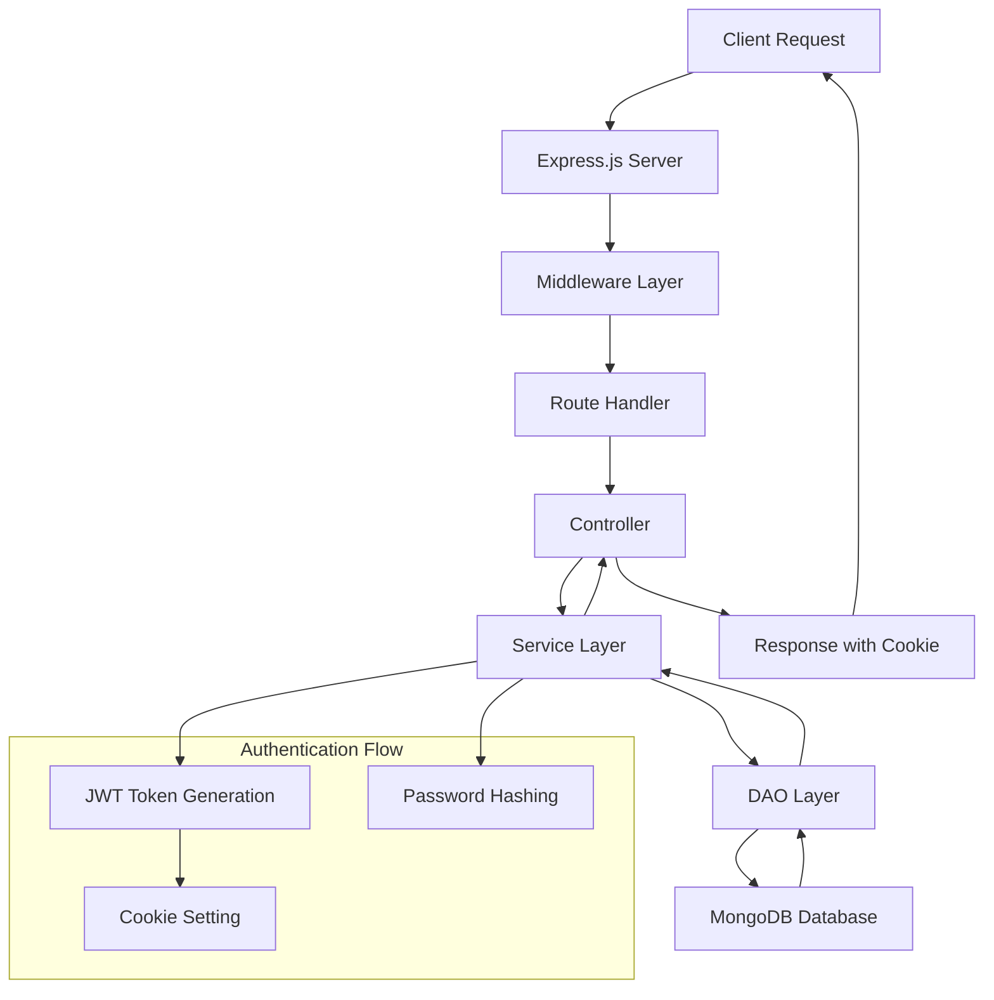
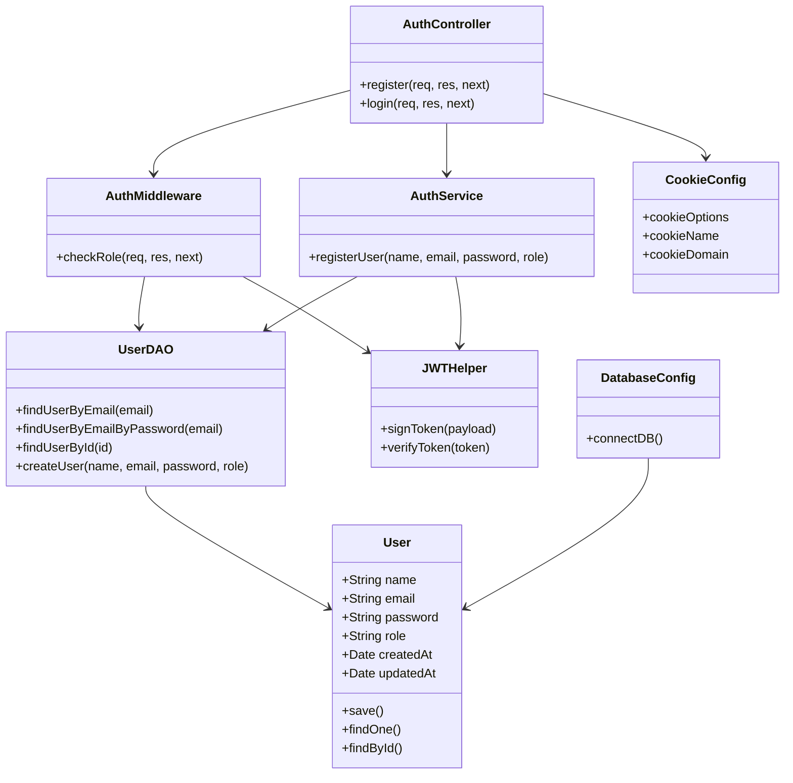
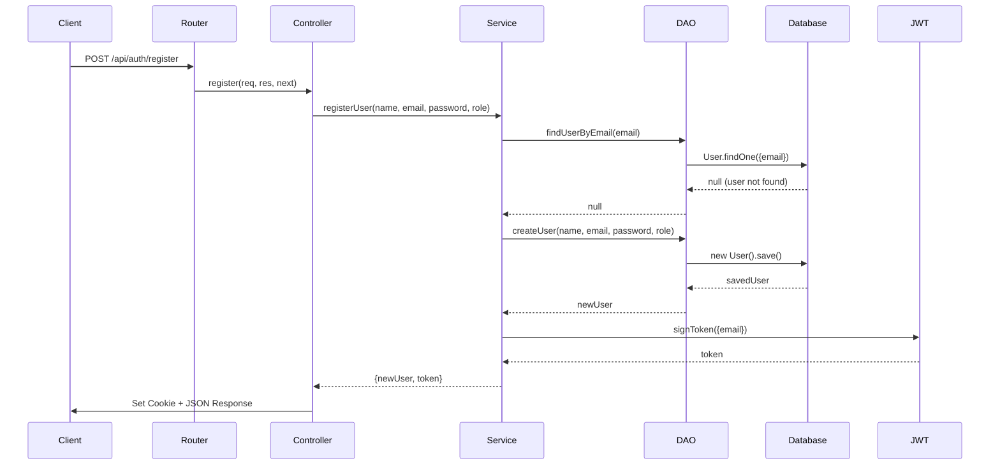
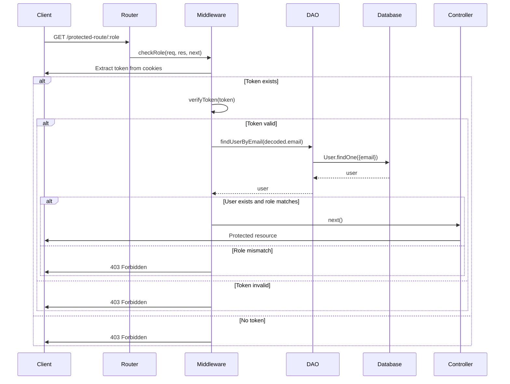
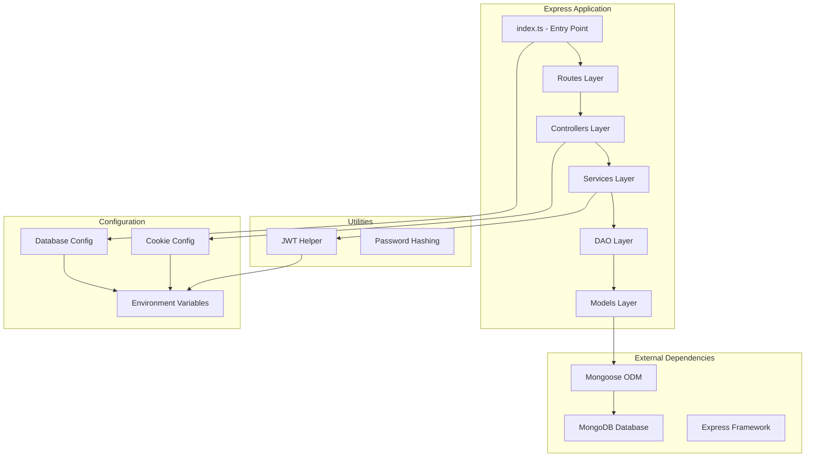

# TMKOC Backend API Documentation

## Table of Contents
1. [Project Overview](#project-overview)
2. [Architecture Overview](#architecture-overview)
3. [System Architecture Flow](#system-architecture-flow)
4. [UML Diagrams](#uml-diagrams)
5. [API Endpoints](#api-endpoints)
6. [Database Schema](#database-schema)
7. [Authentication Flow](#authentication-flow)
8. [Configuration](#configuration)
9. [Development Setup](#development-setup)
10. [Testing](#testing)

## Project Overview

TMKOC Backend API is a Node.js/Express.js application built with TypeScript that provides authentication and user management services. The application uses MongoDB as the database and implements JWT-based authentication with secure cookie management.

### Tech Stack
- **Runtime**: Node.js
- **Framework**: Express.js
- **Language**: TypeScript
- **Database**: MongoDB with Mongoose ODM
- **Authentication**: JWT (JSON Web Tokens)
- **Password Hashing**: bcryptjs
- **Environment Management**: dotenv

## Architecture Overview

The application follows a layered architecture pattern with clear separation of concerns:

```
┌─────────────────────────────────────────────────────────────┐
│                    Presentation Layer                       │
│  ┌─────────────────┐  ┌─────────────────┐                  │
│  │   Controllers   │  │     Routes      │                  │
│  └─────────────────┘  └─────────────────┘                  │
└─────────────────────────────────────────────────────────────┘
┌─────────────────────────────────────────────────────────────┐
│                    Business Logic Layer                     │
│  ┌─────────────────┐  ┌─────────────────┐                  │
│  │    Services     │  │   Middleware    │                  │
│  └─────────────────┘  └─────────────────┘                  │
└─────────────────────────────────────────────────────────────┘
┌─────────────────────────────────────────────────────────────┐
│                    Data Access Layer                        │
│  ┌─────────────────┐  ┌─────────────────┐                  │
│  │      DAO        │  │     Models      │                  │
│  └─────────────────┘  └─────────────────┘                  │
└─────────────────────────────────────────────────────────────┘
┌─────────────────────────────────────────────────────────────┐
│                    Infrastructure Layer                     │
│  ┌─────────────────┐  ┌─────────────────┐                  │
│  │    Database     │  │   Configuration │                  │
│  │   (MongoDB)     │  │     & Utils     │                  │
│  └─────────────────┘  └─────────────────┘                  │
└─────────────────────────────────────────────────────────────┘
```

### Directory Structure
```
backend/
├── src/
│   ├── config/           # Configuration files
│   │   ├── database.ts   # MongoDB connection
│   │   └── cookieConfig.ts # Cookie settings
│   ├── controllers/      # Request handlers
│   │   └── auth.controller.ts
│   ├── dao/             # Data Access Objects
│   │   └── user.dao.ts
│   ├── middleware/      # Custom middleware
│   │   └── auth.middleware.ts # Authentication & authorization
│   ├── models/          # Database models
│   │   └── User.ts
│   ├── routes/          # API routes
│   │   └── auth.routes.ts
│   ├── services/        # Business logic
│   │   └── auth.services.ts
│   ├── utils/           # Utility functions
│   │   └── helper.ts
│   └── index.ts         # Application entry point
├── package.json
├── tsconfig.json
└── test-api.js
```

## System Architecture Flow

The following diagram shows the request flow through the system:



## UML Diagrams

### Class Diagram



### Sequence Diagram - User Registration



### Sequence Diagram - Role-Based Access Control



### Component Diagram



## Middleware

### Authentication Middleware

The application includes a robust authentication middleware system for protecting routes and implementing role-based access control.

#### checkRole Middleware

<augment_code_snippet path="backend/src/middleware/auth.middleware.ts" mode="EXCERPT">
````typescript
export const checkRole = async (req: Request, res: Response, next: NextFunction) => {
    try {
        const token= req.cookies[cookieName];
        if (!token) {
            throw new Error("Not authenticated");
        }
        const decoded = await import('../utils/helper').then(m => m.verifyToken(token));
        if (!decoded || !decoded.email) {
            throw new Error("Not authenticated");
        }
        const user = await import('../dao/user.dao').then(m => m.findUserByEmail(decoded.email));
        if (!user) {
            throw new Error("Not authenticated");
        }
        if (user.role !== req.params.role) {
            throw new Error("Forbidden");
        }
        next();
    } catch (error: any) {
        res.status(403).json({
            success: false,
            message: "Forbidden",
            error: error.message
        });
    }
}
````
</augment_code_snippet>

**Features:**
- **Token Validation**: Extracts and validates JWT tokens from HTTP-only cookies
- **User Authentication**: Verifies user existence in database
- **Role Authorization**: Checks if user has required role for accessing specific resources
- **Error Handling**: Returns appropriate HTTP status codes and error messages

**Usage Example:**
```typescript
// Protect admin-only routes
router.get('/admin/:role', checkRole, adminController);

// Protect user-specific routes
router.get('/user/:role', checkRole, userController);
```

## API Endpoints

### Authentication Endpoints

#### POST /api/auth/register
Register a new user account.

**Request Body:**
```json
{
  "name": "string",
  "email": "string",
  "password": "string",
  "role": "admin" | "user"
}
```

**Response:**
```json
{
  "user": {
    "id": "string",
    "name": "string",
    "email": "string",
    "role": "string",
    "createdAt": "date"
  },
  "success": true,
  "message": "User registered successfully"
}
```

**Cookie Set:** `auth_token` (HTTP-only, secure in production)

#### POST /api/auth/login
Authenticate user login (implementation pending).

### User Management Endpoints

#### POST /api/users
Create a new user (direct database operation).

#### GET /api/users
Retrieve all users (excludes passwords).

## Database Schema

### User Collection

```javascript
{
  _id: ObjectId,
  name: {
    type: String,
    required: true,
    trim: true,
    maxlength: 50
  },
  email: {
    type: String,
    required: true,
    unique: true,
    lowercase: true,
    trim: true,
    match: /^\w+([.-]?\w+)*@\w+([.-]?\w+)*(\.\w{2,3})+$/
  },
  password: {
    type: String,
    required: true,
    minlength: 6
  },
  role: {
    type: String,
    enum: ['admin', 'user'],
    default: 'user'
  },
  createdAt: Date,
  updatedAt: Date
}
```

## Authentication Flow

### Registration Process

1. **Client Request**: User submits registration form
2. **Validation**: Server validates input data
3. **Duplicate Check**: Service checks if email already exists
4. **User Creation**: DAO creates new user in database
5. **Token Generation**: JWT token is generated with user email
6. **Cookie Setting**: Secure HTTP-only cookie is set
7. **Response**: User data and success message returned

### Authorization Process (Role-Based Access Control)

1. **Protected Route Access**: Client attempts to access protected resource
2. **Middleware Execution**: `checkRole` middleware intercepts request
3. **Token Extraction**: JWT token extracted from HTTP-only cookie
4. **Token Verification**: Token signature and expiration validated
5. **User Lookup**: User retrieved from database using token payload
6. **Role Verification**: User's role compared with required role
7. **Access Decision**: Request proceeds or returns 403 Forbidden

### Security Features

- **Password Hashing**: bcryptjs for secure password storage
- **JWT Tokens**: Stateless authentication with 7-day expiration
- **Secure Cookies**: HTTP-only, secure in production, SameSite protection
- **Role-Based Access Control**: Middleware-enforced authorization
- **Input Validation**: Mongoose schema validation
- **Environment Variables**: Sensitive data stored in .env files
- **CSRF Protection**: SameSite cookie attribute prevents cross-site attacks
- **XSS Protection**: HTTP-only cookies prevent client-side script access

## Configuration

### Environment Variables

```bash
# Database
MONGO_URI=mongodb://localhost:27017/tmkoc

# JWT
JWT_SECRET=your-secret-key

# Server
PORT=3000
NODE_ENV=development

# Cookies
COOKIE_DOMAIN=localhost
```

### Cookie Configuration

```typescript
{
  httpOnly: true,                    // Prevent XSS attacks
  secure: NODE_ENV === "production", // HTTPS only in production
  sameSite: "lax",                   // CSRF protection
  maxAge: 7 * 24 * 60 * 60 * 1000   // 7 days
}
```

## Development Setup

### Prerequisites
- Node.js (v16+)
- MongoDB
- npm or yarn

### Installation

1. **Clone Repository**
   ```bash
   git clone <repository-url>
   cd tmkoc/backend
   ```

2. **Install Dependencies**
   ```bash
   npm install
   ```

3. **Environment Setup**
   ```bash
   cp .env.example .env
   # Edit .env with your configuration
   ```

4. **Start Development Server**
   ```bash
   npm run dev
   ```

### Available Scripts

- `npm run dev` - Start development server with hot reload
- `npm run build` - Build TypeScript to JavaScript
- `npm start` - Start production server

## Testing

### Manual Testing

Use the provided `test-api.js` file for basic API testing:

```bash
node test-api.js
```

### Recommended Testing Strategy

1. **Unit Tests**: Test individual functions and methods
2. **Integration Tests**: Test API endpoints and database operations
3. **Authentication Tests**: Verify JWT token generation and validation
4. **Security Tests**: Test input validation and security measures

### Middleware Usage Examples

#### Protecting Admin Routes
```typescript
import { checkRole } from '../middleware/auth.middleware';

// Only users with 'admin' role can access
router.get('/admin/:role', checkRole, adminController);
router.post('/admin/:role', checkRole, createAdminResource);
```

#### Protecting User Routes
```typescript
// Only users with 'user' role can access
router.get('/user/:role', checkRole, userController);
router.put('/user/:role', checkRole, updateUserProfile);
```

#### Custom Middleware Chain
```typescript
// Multiple middleware can be chained
router.post('/protected/:role',
  validateInput,
  checkRole,
  rateLimiter,
  controller
);
```

### Future Enhancements

- [x] Implement role-based access control middleware
- [ ] Complete login implementation
- [ ] Add password reset functionality
- [ ] Add input sanitization middleware
- [ ] Implement rate limiting middleware
- [ ] Add request logging middleware
- [ ] Add comprehensive error handling middleware
- [ ] Create automated test suite
- [ ] Add API documentation with Swagger
- [ ] Implement centralized logging system
- [ ] Add health check endpoints
- [ ] Add CORS middleware configuration
- [ ] Implement request validation middleware

---

**Last Updated**: 2025-06-21
**Version**: 1.0.0
**Author**: TMKOC Development Team
